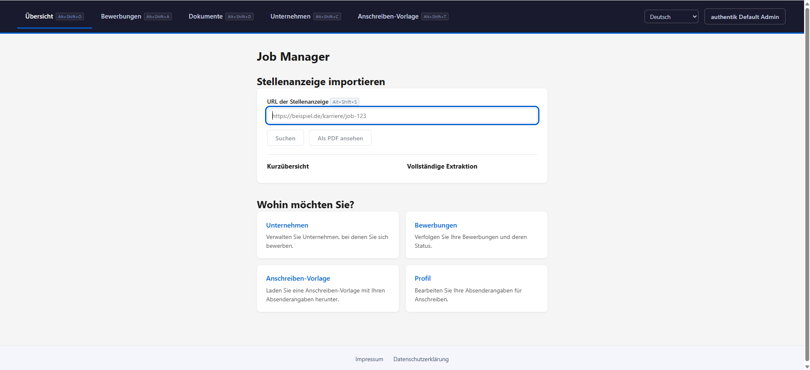

# Accessible Job Manager

**A job application manager for blind and visually impaired users.** Screen reader
operation is not a feature added on top here — it is the premise the architecture is
built on.

> How do you write a hundred job applications efficiently when you cannot see the
> screen — and what does closing that gap mean for equality of opportunity in hiring?

## The problem

Applicants with a visual impairment routinely drop out of the process not because of
the job, but because of the tooling around it:

- inaccessible job portals,
- PDF forms that have to be filled in by hand,
- layout work that a screen reader cannot meaningfully convey.

## The approach

Put the whole process in one accessible place.

**Import instead of retyping.** A job posting is read in from a link and taken over as
structured data.

**Write text, get a letter.** The cover letter is written as text and comes out as a
DIN 5008-compliant PDF. The geometry is a server-side guarantee, so no one has to
arrange fields on a page by hand.

**Keep the search in one place.** Companies, positions, applications and documents are
managed in the same app.

**And not alone.** The role model puts a support team behind the applicant:

- **Advisors** are assigned to their users, see how the search is going, and suggest
  concrete openings with a message attached — so finding and evaluating postings is
  shared work, not one person's burden.
- **Reviewers** get access to exactly the documents a user hands them, to look over an
  application before it goes out.

Every access is granted by the user and can be revoked again: support is offered,
never imposed.

## License and hosting

Open source under the MIT license and built to be self-hosted, so institutions in
vocational rehabilitation can run their own instance and connect it to existing
systems.

---


## Tech Stack

| Layer      | Technology                                          |
|------------|-----------------------------------------------------|
| Backend    | Spring Boot 3.5.16, Java 26, Spring Security OAuth2 |
| Persistence| Spring Data JPA, PostgreSQL 16                      |
| Document   | docx4j (mail merge), Gotenberg (PDF via LibreOffice)|
| Frontend   | Angular 22 (standalone components)                  |
| Auth       | OIDC via Authentik                                  |
| Storage    | Garage (S3-compatible)                              |
| Proxy      | Traefik v2                                          |
| Build      | Gradle 9 (Groovy DSL), Angular CLI 22               |
| Job import | Ollama (local LLM, structured-output extraction)    |
| i18n       | `@ngx-translate/core` (English, German, Dutch)      |

---

## Roles

The three roles exist so that a job seeker can have a support team around them — a
career advisor who searches and coaches, someone trusted who reads over a cover
letter — instead of facing an inaccessible process alone. Each role sees only what
its work requires, and the job seeker controls what is shared.

| Role       | Description                                                                      |
|------------|----------------------------------------------------------------------------------|
| `USER`     | Job seeker — manages companies, applications, documents, generates cover letters |
| `ADVISOR`  | Career advisor — sees assigned users, creates position suggestions               |
| `REVIEWER` | Document reviewer — sees users who shared documents, can download them           |

Roles are assigned via Authentik `groups` claim. The `GroupsGrantedAuthoritiesMapper` normalises group names to uppercase and maps them to Spring Security `ROLE_*` authorities. Create Authentik groups named exactly `Advisor` and `Reviewer` (any casing works — the mapper normalises them).

---

## Accessibility

"Screen reader first" is a claim that is easy to make and easy to break, so here is
what it means concretely in this codebase.

**The document structure is the interface.** Every page is built from real HTML
semantics rather than styled `<div>`s, because that structure is what a screen
reader reads out:

| Pattern | Why it is there |
|---------|-----------------|
| Skip link, visible on keyboard focus | Jump straight to `<main>` instead of tabbing through the navigation on every page |
| `<header>`, `<main id="main-content">`, `<nav aria-label="…">` | Landmark navigation — JAWS and NVDA can jump between regions directly |
| `aria-current="page"` on the active nav link | "Where am I" is announced, not inferred from a colour |
| Separate `<nav>` per role, hidden when not applicable | No dead links to read past |
| `<caption>` and `scope="col"` on every data table | Table cells are announced with the column they belong to |
| Three-state sort with `aria-sort` | Sorting state is readable, not just an arrow glyph |
| `<label>`, `aria-required`, `aria-describedby` on form fields | Purpose, requiredness and error text reach the field itself |
| `role="alert"` / `role="status"` | Errors and empty states are announced when they appear, without moving focus |
| `<dl>`/`<dt>`/`<dd>` for key-value data | Profile and detail views read as pairs, not as a run-on line |

**No layout work is pushed onto the user.** The DIN 5008 geometry of a cover letter
lives in a server-side template (`templates/cover-letter/din5008.html`); the frontend
edits text blocks and style *values* and never computes a millimetre. Positioning an
address block by hand is exactly the kind of task that a PDF form makes hard and a
screen reader makes harder — so the application does it instead.

**The preview is linear text, and it is the same text.** `?format=text` renders the
cover letter from the same assembled model as `?format=pdf`, so what gets read aloud
in the preview is what lands in the PDF. Reimplementing preview logic in the frontend
would let the two drift apart — the one thing a user who cannot check the PDF
visually has no way to notice.

**Nothing is announced twice or not at all.** Translations for all three languages
(en/de/nl) load through an `APP_INITIALIZER` before the first render, so a screen
reader never reads raw i18n keys during a flash of untranslated content.

`AppClient/CLAUDE.md` carries the checklist every UI change is held against.
Verification is currently manual — testing with a real screen reader — there is no
automated accessibility gate (axe, pa11y, Lighthouse) in the build yet.

---

## Features

### User
- **Home** — profile card (name, email, roles), quick navigation; advisors/reviewers are redirected to their own dashboard automatically
  - **Job posting import** — paste a job posting URL; the backend fetches the page and asks a local Ollama LLM to extract company, position, contact and location fields into a ready-to-review form
  - **Personalized cover letter template** — fill in your name, address and email once to download a `.docx` template pre-filled with your sender details, ready to use as a mail-merge source for future applications
- **Applications** — table of all job applications with status labels; per-row template dropdown, one-click PDF/Word cover letter download, and a "send as email" button that opens a `mailto:` link pre-filled with subject and body extracted from the generated cover letter
- **Companies** — manage companies (per-user ownership) with nested locations (street, city, postcode, country) and positions (contact details, gender, email, website)
- **Documents** — upload cover letter templates (`.docx`) with a custom label; label is editable before upload
- **User Guide** — role-aware walkthrough of the app's features, linked from the account menu
- **Profile** — view own account details (name, email, roles)

### Advisor
- **My Users** — table of all users assigned to this advisor
- **Suggestions** — create position suggestions for a user (company + position + optional message), view all past suggestions with status
- **Job search** — search the Adzuna job aggregator (search term, location, radius, age, salary, contract type, category) and hand a result's URL to the existing posting import; off unless the operator configures their own Adzuna key

### Reviewer
- **Dashboard** — shows all users who have shared documents, grouped as cards with name, email and a document table; one-click download per document

### Cover Letter Generation
- User selects an uploaded `.docx` template and a target application
- Backend fills mail-merge fields: `company`, `street`, `city`, `position`, `contact` (salutation, language-aware), `date`
- Gotenberg (LibreOffice headless) converts the filled `.docx` to PDF
- Three output formats from the same template + application pairing:
  - `POST /api/cover-letter/{applicationId}/fill/{documentId}` — PDF download
  - `POST /api/cover-letter/{applicationId}/fill/{documentId}/word` — `.docx` download
  - `POST /api/cover-letter/{applicationId}/fill/{documentId}/email` — returns `{to, subject, body}` with the cover letter's plain text extracted for use in a `mailto:` link
- `POST /api/cover-letter/personalize` — generates a blank template pre-filled with the caller's own sender header (name, street, postal code, city, email)

### Job Posting Import
- `POST /api/posting/overview?url=...` fetches the given URL's visible text (via Jsoup) and sends it to a local Ollama model (`qwen2.5:3b` by default) with a structured-output prompt to extract job posting fields
- Requires a locally running Ollama instance (`OLLAMA_URL`, default `http://localhost:11434`) — not part of the Docker Compose dev stack, must be started separately

### Job Search (Adzuna)
- `GET /api/advisor/job-search?what=&where=…` proxies a search to [Adzuna](https://developer.adzuna.com); `GET /api/advisor/job-search/categories` lists the category filters, `GET /api/advisor/job-search/status` reports whether the feature is configured at all
- Requires an operator-registered `JOBSOURCE_ADZUNA_APP_ID` / `JOBSOURCE_ADZUNA_APP_KEY`. There is no default and no key in the image — without both, every endpoint answers `503` and the frontend hides the feature
- Results are passed straight through and never stored: Adzuna's terms allow a result to be held for at most 14 days, and holding nothing is the simplest way to keep that promise. An advisor who picks a hit imports it from the employer's own page through the normal snapshot path
- The `attribution` field in every response (`Jobs by Adzuna`) is the credit line Adzuna's terms require next to its results

### Legal Pages
- `/impressum` and `/datenschutz` — Impressum (§5 DDG) and GDPR-compliant Datenschutzerklärung, publicly reachable without login (including from the login page footer)
- Both pages are trilingual (en/de/nl) and describe this app's actual data processing (Authentik login data, user-entered application data, uploaded documents, document-sharing grants, session cookie)

### Internationalisation
- Language picker (English/German/Dutch) visible on every page, including the login page, via `LanguageService` + `@ngx-translate/core`
- Initial translation file is loaded via an Angular `APP_INITIALIZER` before first render, avoiding a flash of untranslated i18n keys

### Access Control
- Routes `/companies`, `/applications`, `/documents` are guarded — advisors and reviewers are redirected to `/forbidden`
- Companies are per-user: each user only sees companies they created
- Document access is explicitly granted by the user via `POST /api/documents/{documentId}/access`

---

## Local Development

Full setup instructions live in **[docs/local-development.md](docs/local-development.md)**:
prerequisites, the Docker Compose dev stack, OIDC and Garage configuration,
running backend and frontend, the Angular tests, and running the whole
toolchain remotely with DevPod.

The short version:

```bash
cd dev
docker compose up -d                    # Postgres, Garage, Gotenberg, Traefik
docker compose -f authentik.yml up -d   # Authentik (OIDC)
cd ..
./gradlew bootRun                       # backend on :8060, builds the frontend first
```

Garage needs a one-time bootstrap (layout, bucket, access key) before uploads
work — see [Bootstrapping Garage](docs/local-development.md#bootstrapping-garage).

---

## Key API Endpoints

| Method | Path                                              | Role     | Description                                  |
|--------|---------------------------------------------------|----------|----------------------------------------------|
| GET    | `/api/me`                                         | any      | Current user profile + normalised groups     |
| GET    | `/api/login/as/{role}`                            | any      | Trigger OAuth login (role hint in session)   |
| GET    | `/api/applications`                               | USER     | List own job applications                    |
| POST   | `/api/applications`                               | USER     | Create job application                       |
| GET    | `/api/companies`                                  | USER     | List own companies with locations/positions  |
| POST   | `/api/companies`                                  | USER     | Create company (owned by caller)             |
| PUT    | `/api/companies/{id}`                             | USER     | Update own company                           |
| DELETE | `/api/companies/{id}`                             | USER     | Delete own company                           |
| GET    | `/api/documents`                                  | USER     | List own documents (filter by `?type=`)      |
| POST   | `/api/documents/upload`                           | USER     | Upload document with label                   |
| POST   | `/api/documents/{id}/access`                      | USER     | Grant reviewer access to a document          |
| DELETE | `/api/documents/{id}/access/{reviewerId}`         | USER     | Revoke reviewer access                       |
| POST   | `/api/cover-letter/{appId}/fill/{docId}`          | USER     | Generate filled PDF cover letter             |
| POST   | `/api/cover-letter/{appId}/fill/{docId}/word`     | USER     | Generate filled .docx cover letter           |
| POST   | `/api/cover-letter/{appId}/fill/{docId}/email`    | USER     | Get `{to, subject, body}` for a mailto link  |
| POST   | `/api/cover-letter/personalize`                   | USER     | Generate a template with sender header filled|
| POST   | `/api/posting/overview?url=`                      | USER     | Extract job posting fields from a URL (LLM)  |
| GET    | `/api/advisor/my-users`                           | ADVISOR  | Users assigned to this advisor               |
| GET    | `/api/advisor/job-search?what=&where=`            | ADVISOR  | Search external job boards (Adzuna)          |
| GET    | `/api/advisor/job-search/categories`              | ADVISOR  | Category filters the source accepts          |
| GET    | `/api/advisor/job-search/status`                  | ADVISOR  | Whether a job search source is configured    |
| POST   | `/api/advisor/suggestions`                        | ADVISOR  | Create a position suggestion                 |
| GET    | `/api/advisor/suggestions`                        | ADVISOR  | All suggestions by this advisor              |
| GET    | `/api/reviewer/users`                             | REVIEWER | Users who shared documents with this reviewer|
| GET    | `/api/reviewer/documents/{id}/download`           | REVIEWER | Download a shared document                   |

---

## Database

Connection is configured via environment variables:

```
MANAGER_DB_URL=jdbc:postgresql://localhost:5432/manager
MANAGER_DB_USER=
MANAGER_DB_PASSWORD=
```

Schema is managed by Hibernate (`ddl-auto=update`). For production, switch to Flyway with `ddl-auto=validate`.

---

## Deployment

```bash
cd dev
docker compose up -d --build
```

Builds the full app (including Angular frontend), starts it behind Traefik and serves at `http://login.localhost`. Gotenberg runs as a sidecar for PDF generation.

### Azure Deployment

`dev/azure/main.bicep` provisions a demo deployment to Azure Container Apps. It creates:

| Resource                              | Purpose                                                    |
|----------------------------------------|-------------------------------------------------------------|
| Storage Account + blob container       | Document storage (`STORAGE_PROVIDER=azure`)                |
| Log Analytics workspace                | Required by the Container Apps environment                |
| Container Apps environment             | Hosts the app and Gotenberg                                |
| Azure Database for PostgreSQL Flexible Server | Managed Postgres (first deploy takes ~10-15 min)     |
| Container App: `gotenberg`             | Internal-only, PDF conversion sidecar                      |
| Container App: `app`                   | Public ingress, runs the `appImage` container (defaults to `ghcr.io/martin1088/accessible-job-manager:latest`) |

Deploy with:

```bash
az group create -n ajm-demo -l germanywestcentral
az deployment group create -g ajm-demo -f dev/azure/main.bicep \
    --parameters pgPassword='<STRONG_PW>' \
                 oidcClientId='<CLIENT_ID>' \
                 oidcClientSecret='<CLIENT_SECRET>' \
                 oidcIssuerUri='https://.../application/o/<slug>/' \
                 oidcAuthUri='https://.../application/o/authorize/' \
                 oidcRedirectUri='https://<expected-app-fqdn>/login/oauth2/code/authentik' \
                 groupUser='<entraID_GUID>' \
                 groupAdvisor='<entraID_GUID>' \
                 groupReviewer='<entraID_GUID>'
```

Notes:
- `oidcRedirectUri` depends on the app's FQDN, which is only known after the first deployment (see the `oidcRedirectUri` output). Deploy once with a placeholder, register the real value as the redirect URI in your OIDC provider (Authentik or Entra ID), then redeploy with the real `oidcRedirectUri`.
- `groupUser` / `groupAdvisor` / `groupReviewer` must match whatever the OIDC provider puts in the `groups` claim. For Entra ID cloud-only security groups this is the group's **Object ID** (a GUID), not its display name — pass the GUIDs explicitly.
- Postgres is publicly reachable with an `AllowAzureServices` firewall rule rather than a VNet, since Container Apps on the Consumption plan has no fixed outbound IP; consider private networking for real production data.
- `appMinReplicas` defaults to `0` (scale-to-zero, cheaper but cold-starts on first request).
